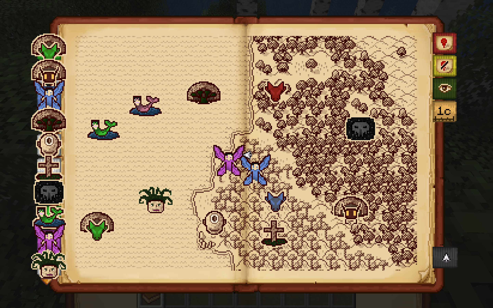

# Antique Atlas - Ice and Fire CE

Adds custom **Antique Atlas 4** markers for structures from **Ice and Fire CE**.

## Features

* Custom markers for Ice and Fire CE structures.
* Hand-drawn icons matching the style of Antique Atlas.
* Designed for **Minecraft 1.20.1** using **Fabric**.

## Preview

## Requirements

* Minecraft 1.20.1
* Fabric Loader
* Fabric API
* Antique Atlas 4 version 3.0 or later

## License

This project is licensed under the **Creative Commons Attribution 4.0 International (CC BY 4.0)** license.

You are free to use, modify and redistribute this project, provided appropriate credit is given to the original author.

## Credits

This addon requires **Antique Atlas 4** by the Antique Atlas Team.

This project is an independent addon and is **not affiliated with or endorsed by the Antique Atlas Team**.

All dragon, cyclops, gorgon, pixie and other marker icons were hand-drawn by **kanade009241**.
